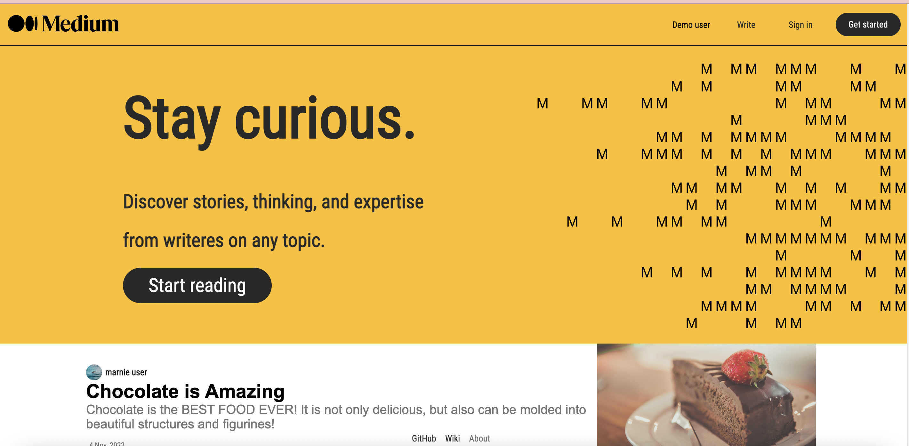
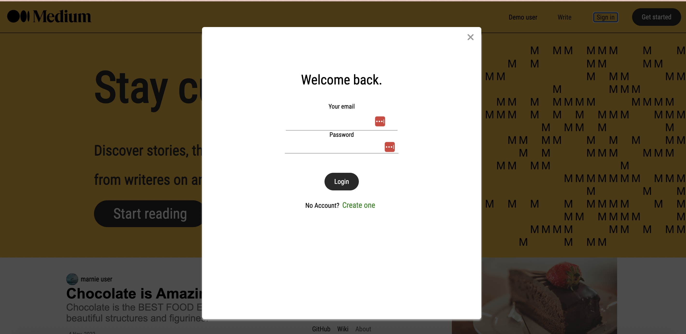
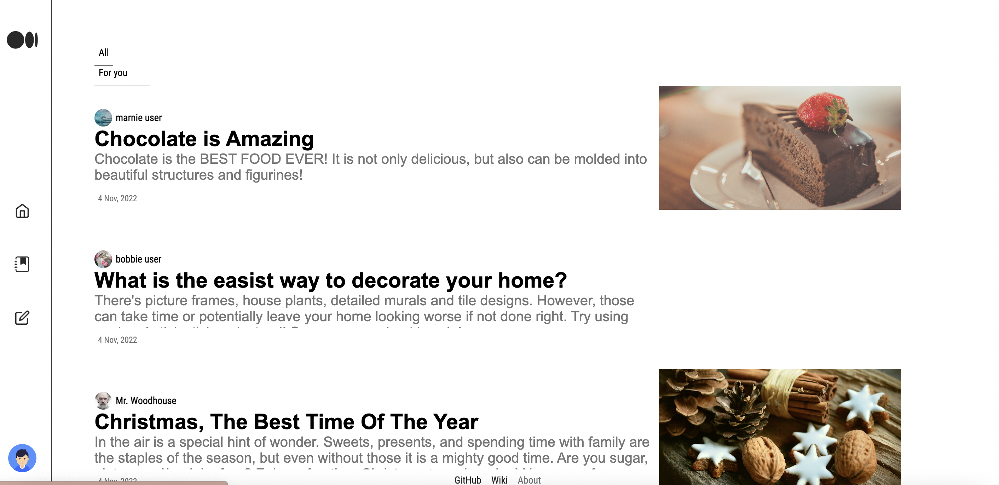
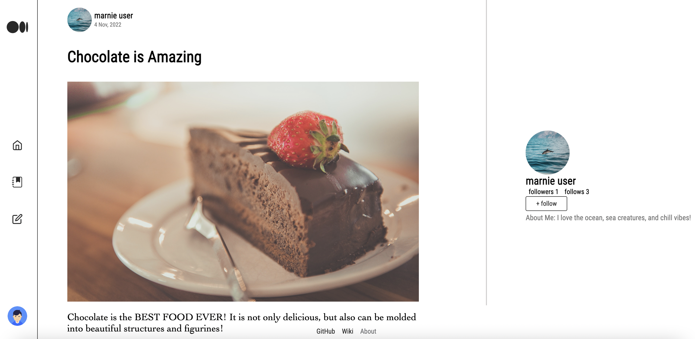
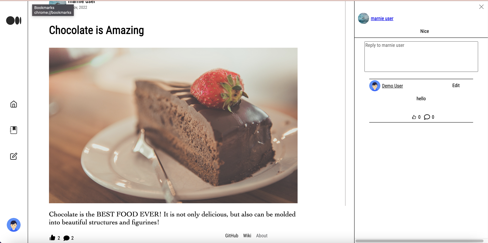
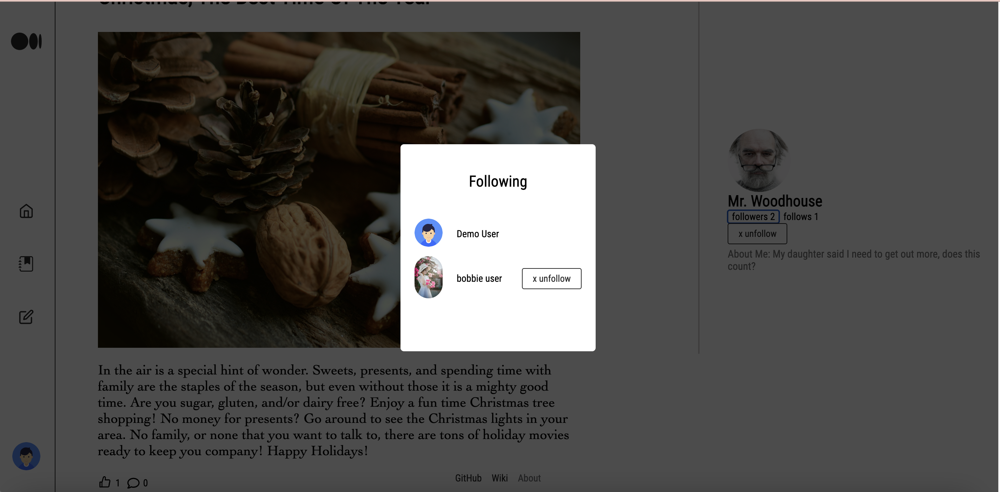
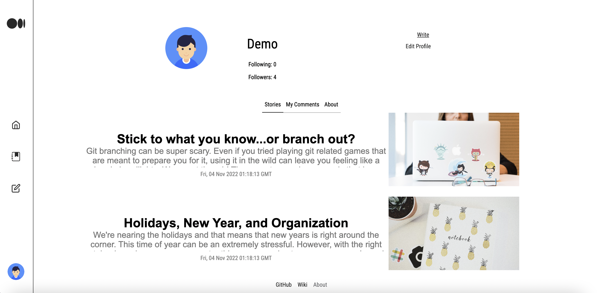

# medium-clone
**medium-clone** is a clone of [Medium](https://Medium.com), a open platform where readers can discover and write on any topic.
**medium-clone** aims to replicate those features both on the front and backend.

## Live site
[Open medium-clone](https://mediumclone.onrender.com)

## Technologies used
### Frontend
* Javascript
* React
* Redux
* FontAwesome
### Backend
* PostgreSQL
* Python
* Flask
* SQLAlchemy

## Getting started
1. Clone the repository
```
git clone https://github.com/KateCiz/MediumClone.git
```

2. Install python dependencies
```
pipenv install --dev -r dev-requirements.txt && pipenv install -r requirements.txt
```

3. Create a `.env` file based on the example provided

4. Setup your PostgreSQL credentials and database according to the variables set in .env

5. Active your pipenv then run the following command to open shell
```
pipenv shell
```

6. Migrate the database
```
flask db upgrade
```

7. Seed the database
```
flask seed all
```

8. Run the flask app
```
flask run
```

9. Navigate to `react-app`

10. Install dependencies
```
npm install
```

11. Start the frontend server
```
npm start
```

The application will now be running at http://localhost:3000/

# CRUD Features

## User
    The clone currently allows a user to:
        - Log in
        - Sign up
        - Explore groups
        - Use the DEMO USER login

## Stories
    As a logged in user you can:
        - Create a new story
        - View the stories create by and others
        - Edit stories you created
        - Delete stories you created

## Comments
    As a logged in user you can:
        - Create a new comment on a story
        - Reply to a comment on a story
        - Edit comments you created
        - Delete delete comments you created
## Follows
    A logged in user can:
        - Follow/Unfollow a user
        - View who is following a user
        - View who a person is following

## Likes
    A logged in user can:
        - Like/Unlike a story or comment
        - View how many likes a story has

## Features

### Home Page
#### 

### Login Modal
#### 

### Stories/Feed
#### 

* View a story
#### 


### Comments
#### 
* Comment on a Story  and other comments, like comments

### Follows
#### 


### User Profile
#### 


# Future Features

This clone is a work in progress, these features will be available in the future...

-  Expand on the create story editor to allow for styling of stories
-  Allow for adding tags to stories to personalize the for you page a bit more
-  allow users to style there profiles
-  add a search bar to search for stories
-  Pagination for Feeds
